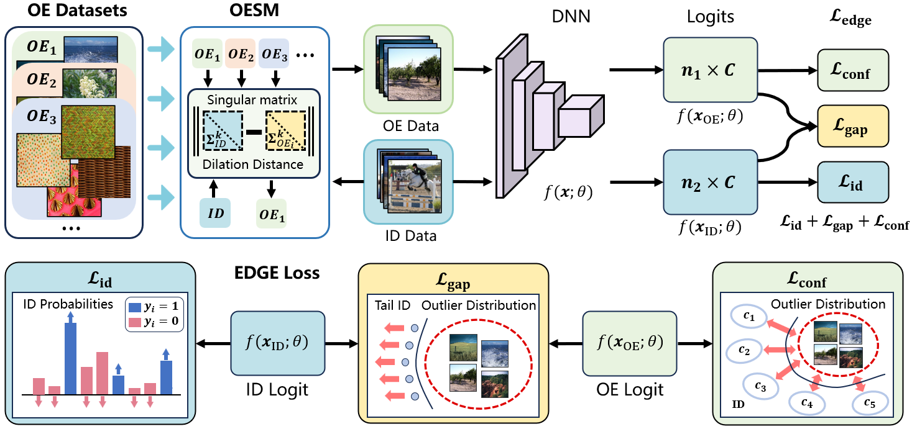

# EDGE: Unknown-aware Multi-label Learning by Energy Distribution Gap Expansion

Official implementation of the paper: **"EDGE: Unknown-aware Multi-label Learning by Energy Distribution Gap Expansion"**.

---

## Overview

This repository addresses the critical challenge of **multi-label Out-of-Distribution (OOD) detection**. We propose a novel framework leveraging **auxiliary Outlier Exposure (OE)** and energy optimization to reshape the energy-based uncertainty landscape. Our key contributions include:

- 🚀 **Energy Score Optimization**: Separately optimizes energy scores for tail ID samples and unknown OOD samples to expand their distribution gap.
- 🔍 **OE Dataset Selection**: A simple yet effective strategy to identify informative OE datasets for improved generalization.
- 🏆 **State-of-the-Art Performance**: Validated on multiple multi-label datasets with diverse OOD benchmarks.

 <!-- Add a diagram if available -->

---

## Key Features

- **Joint Energy Optimization**: Mitigates decision boundary ambiguity for minority classes by explicitly modeling energy gaps.
- **Uncertainty Calibration**: Balances ID classification confidence and OOD detection robustness through energy score disentanglement.
- **OE-Aware Training**: Enhances model discrimination ability without negative transfer from imbalanced ID learning.

---

## Results

Our method achieves consistent improvements over existing multi-label OOD detection baselines. For detailed metrics and comparisons, refer to the [paper](https://arxiv.org/abs/2412.07499).

---

## Installation

```bash
git clone https://github.com/Yuchen-Sunflower/EDGE.git
cd EDGE
pip install -r requirements.txt
```

## Usage

1. **Train the Model**:

```python
python weg.py --arch resnet50 --dataset coco --ood_data imagenet --ood energy --method sum --batch_size=128 –oe_batch_size 128 --start_epoch 50 --n_epoch 100 --l_rate=1e-1 --opt=sgd –alpha 1 --energy_beta 1e-1 --k 32 --m 0 --device-id='0,1'
```

2. **Evaluate OOD Detection**:

```python
python3 eval.py --device-id='0,1' --arch densenet --dataset coco --ood_data imagenet --ood energy --method sum –score joint
```

## Citation

If this work aids your research, please cite:

```tex
@article{sun2025edge,
  title={EDGE: Unknown-aware Multi-label Learning by Energy Distribution Gap Expansion},
  author={Yuchen Sun, Qianqian Xu, Zitai Wang, Zhiyong Yang, Junwei He},
  journal={arXiv preprint arXiv:2412-07499},
  year={2025}
}
```
